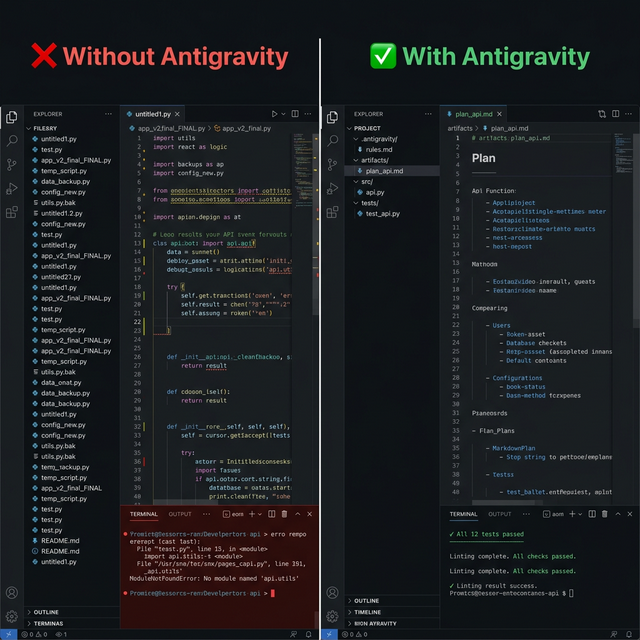

<div align="center">


# AI Workspace Template

### Multi-agent knowledge engine for any codebase.

`ag-refresh` builds a knowledge base. `ag-ask` answers questions. Any LLM, any IDE.

Language: **English** | [中文](README_CN.md) | [Español](README_ES.md)

[](LICENSE)
[](https://python.org/)
[](https://github.com/study8677/antigravity-workspace-template/actions)
[](https://deepwiki.com/study8677/antigravity-workspace-template)
[](https://github.com/xiaolai/nlpm-for-claude)

<br/>


</div>

<br/>

<div align="center">

</div>

<br/>

## Why Antigravity?

> An AI Agent's capability ceiling = **the quality of context it can read.**

The engine is the core: `ag-refresh` deploys a multi-agent cluster that autonomously reads your code — each module gets its own Agent that generates a knowledge doc. `ag-ask` routes questions to the right Agent, grounded in real code with file paths and line numbers.

**Instead of handing Claude Code / Codex a repo-wide `grep` and making it hunt on its own, give it a ChatGPT for your repository.**

**Tested on [OpenClaw](https://github.com/openclaw/openclaw) (12K files, 348K stars) with MiniMax2.7 — module Q&A scored 10/10, 111 modules self-learned in 43 minutes.** [See full eval below.](#real-world-eval-minimax27-on-openclaw-12k-files-348k-stars)

```
Traditional approach:              Antigravity approach:
  CLAUDE.md = 5000 lines of docs     Claude Code calls ask_project("how does auth work?")
  Agent reads it all, forgets most   Router → ModuleAgent reads actual source, returns exact answer
  Hallucination rate stays high      Grounded in real code, file paths, and git history
```

| Problem | Without Antigravity | With Antigravity |
|:--------|:-------------------|:-----------------|
| Agent forgets coding style | Repeats the same corrections | Reads `.antigravity/conventions.md` — gets it right the first time |
| Onboarding a new codebase | Agent guesses at architecture | `ag-refresh` → ModuleAgents self-learn each module |
| Switching between IDEs | Different rules everywhere | One `.antigravity/` folder — every IDE reads it |
| Asking "how does X work?" | Agent reads random files | `ask_project` MCP → Router routes to the responsible ModuleAgent |

Architecture is **files + a live Q&A engine**, not plugins. Portable across any IDE, any LLM, zero vendor lock-in.

---

## Quick Start

**Option A — Engine: multi-agent Q&A on your codebase (recommended)**
```bash
# 1. Install engine + CLI
pip install "git+https://github.com/study8677/antigravity-workspace-template.git#subdirectory=cli"
pip install "git+https://github.com/study8677/antigravity-workspace-template.git#subdirectory=engine"

# 2. Configure .env with any OpenAI-compatible API key
cd my-project
cat > .env <<EOF
OPENAI_BASE_URL=https://your-endpoint/v1
OPENAI_API_KEY=your-key
OPENAI_MODEL=your-model
AG_ASK_TIMEOUT_SECONDS=120
EOF

# 3. Build knowledge base (ModuleAgents self-learn each module)
ag-refresh --workspace .

# 4. Ask anything
ag-ask "How does auth work in this project?"

# 5. (Optional) Register as MCP server for Claude Code
claude mcp add antigravity ag-mcp -- --workspace $(pwd)
```

**Option B — Context files only (any IDE, no LLM needed)**
```bash
pip install git+https://github.com/study8677/antigravity-workspace-template.git#subdirectory=cli
ag init my-project && cd my-project
# IDE entry files bootstrap into AGENTS.md; dynamic knowledge is in .antigravity/
```

---

## Features at a Glance

```
  ag init             Inject context files into any project (--force to overwrite)
       │
       ▼
  .antigravity/       Shared knowledge base — every IDE reads from here
       │
       ├──► ag-refresh     Dynamic multi-agent self-learning → module knowledge docs + structure map
       ├──► ag-ask         Router → ModuleAgent Q&A with live code evidence
       └──► ag-mcp         MCP server → Claude Code calls directly
```

**Dynamic Multi-Agent Cluster** — During `ag-refresh`, the engine uses **smart functional grouping**: files are grouped by import relationships, directory co-location, and filename prefixes. Source code is pre-loaded directly into agent context (no tool calls needed), and build artifacts are automatically filtered out. Each sub-agent analyzes ~30K tokens of focused, functionally related code in a single LLM call and outputs a **comprehensive Markdown knowledge document** (`agents/*.md`). For large modules, multiple sub-agents run in parallel — each produces its own agent.md (no merging, no information loss). A **Map Agent** reads all agent docs and generates `map.md` — a routing index. During `ag-ask`, Router reads `map.md` to select relevant modules, then feeds their agent docs to answer agents. For structural questions (call chains, dependencies, impact analysis), the Router automatically queries [GitNexus](https://github.com/abhigyanpatwari/GitNexus) code graph for precise relationships. **Fully language-agnostic** — module detection uses pure directory structure, code analysis is done entirely by LLMs. Works with any programming language.

**GitAgent** — A dedicated agent for analyzing git history — understands who changed what and why.

**GitNexus Graph Enrichment (optional)** — Install [GitNexus](https://github.com/abhigyanpatwari/GitNexus) to auto-unlock graph-enriched answers. The Router LLM decides when a question needs structural analysis (call chains, dependencies, impact) and queries GitNexus automatically — combining precise graph data with semantic understanding from agent docs.

**NLPM Audit Feedback** — This repository has benefited from [NLPM](https://github.com/xiaolai/nlpm-for-claude), a natural-language programming linter for Claude Code plugins, skills, and agent definitions by [xiaolai](https://github.com/xiaolai). Its audit helped identify useful improvements in skill frontmatter and dependency hygiene.

---

## CLI Commands

| Command | What it does | LLM needed? |
|:--------|:-------------|:-----------:|
| `ag init <dir>` | Inject cognitive architecture templates | No |
| `ag init <dir> --force` | Re-inject, overwriting existing files | No |
| `ag refresh --workspace <dir>` | CLI convenience wrapper around the knowledge-hub refresh pipeline | Yes |
| `ag ask "question" --workspace <dir>` | CLI convenience wrapper around the routed project Q&A flow | Yes |
| `ag-refresh` | Multi-agent self-learning of codebase, generates module knowledge docs + `conventions.md` + `structure.md` | Yes |
| `ag-ask "question"` | Router → ModuleAgent/GitAgent routed Q&A | Yes |
| `ag-mcp --workspace <dir>` | **Start MCP server** — exposes `ask_project` + `refresh_project` to Claude Code | Yes |
| `ag report "message"` | Log a finding to `.antigravity/memory/` | No |
| `ag log-decision "what" "why"` | Log an architectural decision | No |

`ag ask` / `ag refresh` are available when both `cli/` and `engine/` are installed. `ag-ask` / `ag-refresh` are the engine-only entrypoints.

---

## Two Packages, One Workflow

```
antigravity-workspace-template/
├── cli/                     # ag CLI — lightweight, pip-installable
│   └── templates/           # .cursorrules, CLAUDE.md, .antigravity/, ...
└── engine/                  # Multi-agent engine + Knowledge Hub
    └── antigravity_engine/
        ├── _cli_entry.py    # ag-ask / ag-refresh / ag-mcp + python -m dispatch
        ├── config.py        # Pydantic configuration
        ├── hub/             # ★ Core: multi-agent cluster
        │   ├── agents.py    #   Router + ModuleAgent + GitAgent
        │   ├── contracts.py #   Pydantic models: claims, evidence, refresh status
        │   ├── ask_pipeline.py    # agent.md + graph-enriched ask
        │   ├── refresh_pipeline.py # LLM-driven refresh → agents/*.md + map.md
        │   ├── ask_tools.py
        │   ├── scanner.py   #   multi-language project scanning
        │   ├── module_grouping.py # smart functional file grouping
        │   ├── structure.py
        │   ├── knowledge_graph.py
        │   ├── retrieval_graph.py
        │   └── mcp_server.py
        ├── mcp_client.py    # MCP consumer (connects external tools)
        ├── memory.py        # Persistent interaction memory
        ├── tools/           # MCP query tools + extensions
        ├── skills/          # Skill loader
        └── sandbox/         # Code execution (local / microsandbox)
```

**CLI** (`pip install .../cli`) — Zero LLM deps. Injects templates, logs reports & decisions offline.

**Engine** (`pip install .../engine`) — Multi-agent runtime. Powers `ag-ask`, `ag-refresh`, `ag-mcp`. Supports Gemini, OpenAI, Ollama, or any OpenAI-compatible API.

**New skill packaging updates:**
- `engine/antigravity_engine/skills/graph-retrieval/` — graph-oriented retrieval tools for structure and call-path reasoning.
- `engine/antigravity_engine/skills/knowledge-layer/` — project knowledge-layer tools for semantic context consolidation.

```bash
# Install both for full experience
pip install "git+https://...#subdirectory=cli"
pip install "git+https://...#subdirectory=engine"
```

For local work on this repository itself:

```bash
python3 -m venv venv
source venv/bin/activate
pip install -e ./cli -e './engine[dev]'
pytest engine/tests cli/tests
```

---

## How It Works

### 1. `ag init` — Inject context files

```bash
ag init my-project
# Already initialized? Use --force to overwrite:
ag init my-project --force
```

Creates `AGENTS.md` (authoritative behavior rules), IDE bootstrap files (`.cursorrules`, `CLAUDE.md`, `.windsurfrules`, `.clinerules`, `.github/copilot-instructions.md`), and `.antigravity/` dynamic context files.

### 2. `ag-refresh` — Multi-agent self-learning

```bash
ag-refresh --workspace my-project
```

**9-step pipeline:**
1. Scan codebase (languages, frameworks, structure)
2. Multi-agent pipeline generates `conventions.md`
3. Generate `structure.md` — language-agnostic file tree with line counts
4. Build knowledge graph (`knowledge_graph.json` + mermaid)
5. Write document/data/media indexes
6. **LLM full-context analysis** — group files by import graph + directory + prefix, pre-load into context (~30K tokens per sub-agent), filter out build artifacts. Each sub-agent reads the full source code and outputs a **comprehensive Markdown knowledge document** (`agents/*.md`). Large modules get multiple agent docs (one per group, no merging). Global API concurrency control prevents rate-limiting. **Fully language-agnostic** — works with any programming language.
7. **RefreshGitAgent** analyzes git history, generates `_git_insights.md`
8. **Map Agent** reads all agent docs → generates `map.md` (module routing index with descriptions and key topics)
9. **GitNexus indexing** (optional) — runs `gitnexus analyze` to build a Tree-sitter code graph (16 languages, call chains, dependencies). Auto-skipped if GitNexus is not installed.

### 3. `ag-ask` — Router-based Q&A

```bash
ag-ask "How does auth work in this project?"
```

The ask pipeline uses a **dual-path architecture**:
- **Semantic path**: Router reads `map.md` → selects modules → reads `agents/*.md` → LLM answers with code references. Multiple agent docs are read in parallel, then a Synthesizer combines answers.
- **Graph path** (automatic): Router LLM decides if the question needs structural analysis → queries GitNexus for call chains, dependencies, or impact → injects graph data into the answer context. Silently skipped if GitNexus is not installed.

Falls back to the legacy Router → ModuleAgent/GitAgent swarm when agent docs are not yet generated.

---

## IDE Compatibility

Architecture is encoded in **files** — any agent that reads project files benefits:

| IDE | Config File |
|:----|:------------|
| Cursor | `.cursorrules` |
| Claude Code | `CLAUDE.md` |
| Windsurf | `.windsurfrules` |
| VS Code + Copilot | `.github/copilot-instructions.md` |
| Gemini CLI / Codex | `AGENTS.md` |
| Cline | `.clinerules` |
| Google Antigravity | `.antigravity/rules.md` |

All are generated by `ag init`: `AGENTS.md` is the single behavioral rulebook, IDE-specific files are thin bootstraps, and `.antigravity/` stores shared dynamic project context.

---

## Advanced Features

<details>
<summary><b>MCP Server — Give Claude Code a ChatGPT for your codebase</b></summary>

Instead of reading hundreds of documentation files, Claude Code can call `ask_project` as a live tool — backed by a dynamic multi-agent cluster: Router routes questions to the right ModuleAgent, returning grounded answers with file paths and line numbers.

**Setup:**

```bash
# Install engine
pip install "git+https://github.com/study8677/antigravity-workspace-template.git#subdirectory=engine"

# Refresh knowledge base first (ModuleAgents self-learn each module)
ag-refresh --workspace /path/to/project

# Register as MCP server in Claude Code
claude mcp add antigravity ag-mcp -- --workspace /path/to/project
```

**Tools exposed to Claude Code:**

| Tool | What it does |
|:-----|:-------------|
| `ask_project(question)` | Router → ModuleAgent/GitAgent answers codebase questions. Returns file paths + line numbers. |
| `refresh_project(quick?)` | Rebuild knowledge base after significant changes. ModuleAgents re-learn the code. |

</details>

<details>
<summary><b>Dynamic Multi-Agent Cluster</b> — Module-level self-learning + intelligent routing</summary>

The engine's core is **a dynamically created Agent cluster per code module**:

```
 ag-refresh:                                 ag-ask:

 For each module:                            Router (reads map.md)
 ┌ Group files by import graph                 ├── GRAPH: no → read agents/*.md → LLM answer
 ├ Pre-load ~30K tokens per sub-agent          └── GRAPH: yes → query GitNexus graph
 ├ Filter out build artifacts                        → graph data + agents/*.md → LLM answer
 ├ Sub-agents → Markdown agent docs
 ├ agents/{module}.md (or /group_N.md)
 ├ Map Agent → map.md
 └ GitNexus analyze (optional)
```

**Key innovations:**
- **LLM as analyzer**: No AST parsing or regex — source code is fed directly to LLMs for analysis. Works with any programming language out of the box.
- **Smart grouping**: Files grouped by import relationships, directory co-location, and filename prefixes. Build artifacts automatically filtered out. Hard character limit (800K) prevents context overflow.
- **No information loss**: Large modules produce multiple `agent.md` files (one per group) — no merging or compression. During `ag-ask`, multiple agent docs are read by parallel LLM calls, then a Synthesizer combines answers.
- **Graph-enriched answers**: Router LLM automatically decides when a question needs structural data (call chains, dependencies, impact) and queries GitNexus. Combines precise graph relationships with semantic understanding.
- **Global API concurrency control**: `AG_API_CONCURRENCY` limits total simultaneous LLM calls across all modules, preventing rate-limiting.
- **Language-agnostic module detection**: Pure directory structure — no `__init__.py` or any language-specific marker required.

```bash
# ModuleAgents self-learn your codebase
ag-refresh

# Only scan files changed since last refresh
ag-refresh --quick

# Router intelligently routes to the right ModuleAgent
ag-ask "What testing patterns does this project use?"

# Log findings and decisions (no LLM needed)
ag report "Auth module needs refactoring"
ag log-decision "Use PostgreSQL" "Team has deep expertise"
```

Works with Gemini, OpenAI, Ollama, or any OpenAI-compatible endpoint. Powered by OpenAI Agent SDK + LiteLLM.
</details>

<details>
<summary><b>MCP Integration (Consumer)</b> — Let agents call external tools</summary>

`MCPClientManager` lets your agents connect to external MCP servers (GitHub, databases, etc.), auto-discovering and registering tools.

```json
// mcp_servers.json
{
  "servers": [
    {
      "name": "github",
      "transport": "stdio",
      "command": "npx",
      "args": ["-y", "@modelcontextprotocol/server-github"],
      "enabled": true
    }
  ]
}
```

Set `MCP_ENABLED=true` in `.env`.
</details>

<details>
<summary><b>GitNexus Graph Enrichment</b> — Automatic structural intelligence for ask queries</summary>

[GitNexus](https://github.com/abhigyanpatwari/GitNexus) builds a code knowledge graph using **Tree-sitter AST parsing** (16 languages). When installed, Antigravity integrates it at two levels:

**1. Refresh-time indexing** — `ag-refresh` automatically runs `gitnexus analyze` (Step 9) to build/update the code graph. Skipped silently if GitNexus is not installed.

**2. Ask-time graph enrichment** — The Router LLM decides whether a question needs structural analysis:
- "What does the auth module do?" → `GRAPH: no` → pure agent.md answer
- "Who calls handleLogin?" → `GRAPH: yes` → queries GitNexus → graph data + agent.md → enriched answer

```
User: "What functions call the send method in gateway?"

Router: MODULES: gateway, tests_gateway | GRAPH: yes
  → GitNexus query returns call chains with confidence scores
  → Agent docs provide semantic context (what each caller does)
  → Combined answer: precise call chain + file paths + line numbers + purpose
```

| Capability | What it provides |
|:-----------|:-----------------|
| `gitnexus_query` | Hybrid search (BM25 + semantic) — execution flows, not just files |
| `gitnexus_context` | 360-degree symbol view: callers, callees, references, definition |
| `gitnexus_impact` | Blast radius analysis — what breaks if you change a symbol? |

> **Note:** GitNexus is NOT bundled with Antigravity. It requires separate installation via npm (`npm install -g gitnexus`). Antigravity works fully without it — when not installed, all graph features are silently skipped with zero overhead.

**How to enable:**

```bash
# 1. Install GitNexus (requires Node.js)
npm install -g gitnexus

# 2. Refresh (auto-indexes the code graph)
ag-refresh --workspace my-project

# 3. Ask — graph enrichment is automatic
ag-ask "Who calls the send method in gateway adapters?"
# Router decides: GRAPH: yes → queries GitNexus → enriched answer
```

</details>


<details>
<summary><b>Sandbox</b> — Configurable code execution environment</summary>

| Variable | Default | Options |
|:---------|:--------|:--------|
| `SANDBOX_TYPE` | `local` | `local` · `microsandbox` |
| `SANDBOX_TIMEOUT_SEC` | `30` | seconds |

See [Sandbox docs](docs/en/SANDBOX.md).
</details>

---

## Real-World Eval: MiniMax2.7 on OpenClaw (12K files, 348K stars)

Tested against [OpenClaw](https://github.com/openclaw/openclaw) — the most popular open-source AI assistant (TypeScript + Swift + Kotlin, 12,133 files) — using **MiniMax2.7** free API.

### Refresh results

```
$ ag-refresh --workspace /path/to/openclaw
[1/3] Scanning project... 5000 files, 0.14s
[7/8] ▶ Running 154 modules (concurrency=8)...
      Auto-split: extensions/ → 50+ sub-modules (slack, telegram, whatsapp, ...)
      Auto-split: src/ → 40+ sub-modules (agents, gateway, config, ...)
[8/8] module_registry ✅ 164 lines

Total time: 42m52s | 111 module docs | 1.5MB knowledge base
```

### Ask evaluation matrix (11 tests)

| Category | Question | Result | Quality |
|:---------|:---------|:------:|:-------:|
| Basic understanding | "What is this project?" | **Pass** | 5/5 — sponsors, platforms, features, structure |
| Tech stack | "Tech stack and frameworks?" | Timeout | 3/5 — fallback gave language/framework data |
| Module deep-dive | "How does Telegram integration work?" | **Pass** | **5/5** — file table + architecture diagram + types + constants |
| Module deep-dive | "Discord voice channels?" | **Pass** | **5/5** — audio pipeline + code samples + design patterns |
| Module deep-dive | "WhatsApp integration?" | **Pass** | **5/5** — auth flow + plugin architecture + dependencies |
| Hallucination test | "Does this support GraphQL?" | 413 | 0/5 — request too large for free API |
| Architecture | "How does Gateway work?" | Timeout | 2/5 — file list but no analysis |
| Chinese query | "支持哪些AI模型？" | Timeout | 1/5 — cross-module, needs faster model |
| Skills system | "What is the skill system?" | Timeout | 2/5 — listed skill files |
| Testing patterns | "Testing frameworks?" | Timeout | 2/5 — listed vitest configs |
| Platform listing | "What messaging platforms?" | Crash | 0/5 — 413 error |

### Key finding: auto-split unlocks module-level excellence

```
 ✅ Module-level Q&A (5/5)              ⚠️ Cross-module questions              ❌ Free API limits
 ──────────────────────────             ────────────────────────              ─────────────────
 Telegram: architecture diagram         Gateway: timeout                      413 on large context
 Discord: audio pipeline + code         Testing: timeout                      Rate limiting (429)
 WhatsApp: auth + plugin system         Tech stack: timeout
 Each module has its own knowledge doc  Needs faster model or higher timeout
```

### Scores

| Dimension | Score | Notes |
|:----------|:-----:|:------|
| Basic Q&A | **9/10** | Project overview excellent |
| Module deep-dive | **10/10** | Telegram/Discord/WhatsApp — architecture diagrams, types, design patterns |
| Cross-module | **3/10** | Gateway, Testing, Skills — timeout with free API |
| **Overall** | **6.5/10** | **Module Q&A: production-ready even on 12K-file projects. Cross-module: needs faster model.** |

### Performance comparison

| Metric | OpenCMO (374 files) | OpenClaw (12K files) | Improvement |
|:-------|:-------------------:|:--------------------:|:-----------:|
| Refresh time | ~10 min | **43 min** | Parallel + auto-split |
| Module docs | 9 | **111** | 12x |
| Knowledge base | 540KB | **1.5MB** | 2.8x |
| Module Q&A quality | 7/10 | **10/10** | Auto-split = focused knowledge |

> **What changed:** Large modules (extensions/ with 262 groups, src/ with 363 groups) are now auto-split into independent sub-modules. All modules run in parallel (8 concurrency). This reduced OpenClaw refresh from **5+ hours (never finished)** to **43 minutes (completed)**.

### Quick config for best results

```bash
# .env — recommended settings after eval
OPENAI_BASE_URL=https://your-openai-compatible-endpoint/v1
OPENAI_API_KEY=your-key
OPENAI_MODEL=your-model

# Tuning — raise timeouts for large repos
AG_ASK_TIMEOUT_SECONDS=120
AG_REFRESH_AGENT_TIMEOUT_SECONDS=180
AG_MODULE_AGENT_TIMEOUT_SECONDS=300
AG_API_CONCURRENCY=5           # Max simultaneous LLM calls (prevents rate-limiting)
AG_MAX_GROUP_CHARS=800000      # Hard char limit per group (prevents context overflow)
```

> Works with any OpenAI-compatible provider: **NVIDIA**, **OpenAI**, **Ollama**, **vLLM**, **LM Studio**, **Groq**, **MiniMax**, etc.

---

<details>
<summary><b>Earlier Eval: MiniMax2.7 on OpenCMO (374 files, 29K lines)</b></summary>

Tested end-to-end against the [OpenCMO](https://github.com/study8677/OpenCMO) codebase (Python + React/TS, 374 files) using **MiniMax2.7** via an OpenAI-compatible router.

### Ask evaluation matrix (18 tests)

| Category | Question | Result | Quality |
|:---------|:---------|:------:|:-------:|
| Basic understanding | "What is this project?" | **Pass** | 5/5 — accurate summary with tech details |
| Tech stack | "What tech stack and frameworks?" | **Pass** | 5/5 — frontend + backend + libs listed |
| Module listing | "List all main modules" | **Pass** | 5/5 — table format, accurate |
| API routing | "How does API routing work?" | **Pass** | 5/5 — routes + endpoints + client code |
| Precise function | "get_model() in llm.py signature" | **Pass** | 5/5 — **100% accurate** file, line, logic |
| Hallucination test | "Does this support GraphQL?" | **Pass** | 5/5 — correctly said **No** with 4-point evidence |
| Chinese query | "社区监控支持哪些平台?" | **Pass** | 5/5 — Chinese answer, platform style table |
| Database schema | "List all database tables" | **Pass** | 5/5 — 34 tables listed with source file |
| Approval workflow | "How does approval work?" | **Pass** | 5/5 — full state machine with line numbers |
| Complex architecture | "How does multi-agent work?" (120s) | **Pass** | 5/5 — 20 agents listed, comm patterns |

### Scores

| Dimension | Score | Notes |
|:----------|:-----:|:------|
| Basic Q&A | **9/10** | Project, tech stack, modules — excellent |
| Code location | **7/10** | Precise queries great; same-name files can confuse |
| Hallucination control | **9/10** | Won't fabricate; gives negative evidence |
| Multi-language | **9/10** | Chinese Q&A excellent |
| **Overall** | **7/10** | **Daily code Q&A: production-ready. Complex analysis: tune timeout.** |

> Full evaluation report: [`artifacts/plan_20260404_opencmo_ask_boundary_eval.md`](artifacts/plan_20260404_opencmo_ask_boundary_eval.md)

</details>

---

## Documentation

| | |
|:--|:--|
| 🇬🇧 English | **[`docs/en/`](docs/en/)** |
| 🇨🇳 中文 | **[`docs/zh/`](docs/zh/)** |
| 🇪🇸 Español | **[`docs/es/`](docs/es/)** |

---

## Contributing

Ideas are contributions too! Open an [issue](https://github.com/study8677/antigravity-workspace-template/issues) to report bugs, suggest features, or propose architecture.

## Contributors

<table>
  <tr>
    <td align="center" width="20%">
      <a href="https://github.com/Lling0000">
        <br/>
        <b>⭐ Lling0000</b>
      </a><br/>
      <sub><b>Major Contributor</b> · Creative suggestions · Project administrator · Project ideation & feedback</sub>
    </td>
    <td align="center" width="20%">
      <a href="https://github.com/devalexanderdaza">
        <br/>
        <b>Alexander Daza</b>
      </a><br/>
      <sub>Sandbox MVP · OpenSpec workflows · Technical analysis docs · PHILOSOPHY</sub>
    </td>
    <td align="center" width="20%">
      <a href="https://github.com/chenyi">
        <br/>
        <b>Chen Yi</b>
      </a><br/>
      <sub>First CLI prototype · 753-line refactor · DummyClient extraction · Quick-start docs</sub>
    </td>
    <td align="center" width="20%">
      <a href="https://github.com/Subham-KRLX">
        <br/>
        <b>Subham Sangwan</b>
      </a><br/>
      <sub>Dynamic tool & context loading (#4) · Multi-agent swarm protocol (#3)</sub>
    </td>
    <td align="center" width="20%">
      <a href="https://github.com/shuofengzhang">
        <br/>
        <b>shuofengzhang</b>
      </a><br/>
      <sub>Memory context window fix · MCP shutdown graceful handling (#28)</sub>
    </td>
  </tr>
  <tr>
    <td align="center" width="20%">
      <a href="https://github.com/goodmorning10">
        <br/>
        <b>goodmorning10</b>
      </a><br/>
      <sub>Enhanced <code>ag ask</code> context loading — added CONTEXT.md, AGENTS.md, and memory/*.md as context sources (#29)</sub>
    </td>
    <td align="center" width="20%">
      <a href="https://github.com/abhigyanpatwari">
        <br/>
        <b>Abhigyan Patwari</b>
      </a><br/>
      <sub><a href="https://github.com/abhigyanpatwari/GitNexus">GitNexus</a> — code knowledge graph natively integrated into <code>ag ask</code> for symbol search, call graphs, and impact analysis</sub>
    </td>
    <td align="center" width="20%">
      <a href="https://github.com/BBear0115">
        <br/>
        <b>BBear0115</b>
      </a><br/>
      <sub>Skill packaging & KG retrieval enhancements · Multi-language README sync (#30)</sub>
    </td>
    <td align="center" width="20%">
      <a href="https://github.com/SunkenCost">
        <br/>
        <b>SunkenCost</b>
      </a><br/>
      <sub><code>ag clean</code> command · <code>__main__</code> entry-point guard (#37)</sub>
    </td>
    <td align="center" width="20%">
      <a href="https://github.com/aravindhbalaji04">
        <br/>
        <b>Aravindh Balaji</b>
      </a><br/>
      <sub>Unified instruction surface around <code>AGENTS.md</code> (#41)</sub>
    </td>
  </tr>
  <tr>
    <td align="center" width="20%">
      <a href="https://github.com/xiaolai">
        <br/>
        <b>xiaolai</b>
      </a><br/>
      <sub><a href="https://github.com/xiaolai/nlpm-for-claude">NLPM</a> audit feedback · Skill frontmatter fixes · Dependency hygiene review (#51, #52, #53)</sub>
    </td>
  </tr>
</table>

## Star History

[](https://star-history.com/#study8677/antigravity-workspace-template&Date)

## License

MIT License. See [LICENSE](LICENSE) for details.

---

<div align="center">

**[📚 Full Documentation →](docs/en/)**

*Built for the AI-native development era*

Friendly Link: [LINUX DO](https://linux.do/)

</div>
