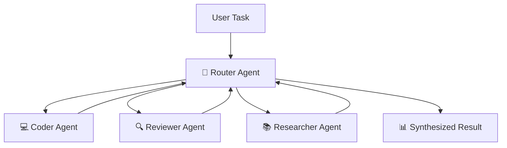

# 🔥 Multi-Agent Swarm Protocol

## 🪐 Architecture: Router-Worker Pattern

The Antigravity Workspace includes a sophisticated multi-agent swarm system based on the Router-Worker pattern. This allows complex tasks to be decomposed and handled by specialist agents working in coordination.



## 🧠 Specialist Agents

### 🧭 Router Agent
**Role**: Task analyzer, strategist, and conductor

The Router analyzes incoming tasks, determines the best decomposition strategy, delegates subtasks to specialists, and synthesizes final results.

**Capabilities:**
- 🎯 Complex task analysis
- 📋 Strategic planning
- 🔀 Work distribution
- 🧩 Result synthesis

### 💻 Coder Agent
**Role**: Implementation specialist

Writes clean, well-documented, production-ready code following Google style guide conventions.

**Specialties:**
- 🐍 Python development
- 🎨 Clean code architecture
- 📝 Comprehensive docstrings
- 🧪 Test coverage

### 🔍 Reviewer Agent
**Role**: Quality assurance expert

Reviews implementations for correctness, security, performance, and best practices.

**Specialties:**
- ✅ Code quality assessment
- 🔒 Security analysis
- ⚡ Performance optimization
- 📋 Best practice verification

### 📚 Researcher Agent
**Role**: Information gatherer and investigator

Researches solutions, gathers context, and provides foundational knowledge for complex tasks.

**Specialties:**
- 🔎 Problem research
- 📚 Information synthesis
- 🧠 Context gathering
- 💡 Insight generation

## 🚀 Using the Swarm

### Run Interactive Demo

```bash
python -m antigravity_engine.swarm_demo
```

This launches an interactive prompt where you can assign tasks to the swarm and watch specialists collaborate.

### Example Interaction

```
🧭 [Router] What task would you like me to help with?
> Build a calculator that supports basic math operations and review it for security

🧭 [Router] Analyzing task...
📤 [Router → Coder] Build a calculator with +, -, *, / operations
💻 [Coder] Creating calculator implementation...
📝 [Coder] Generating comprehensive tests...
✅ [Coder] Implementation complete!

📤 [Router → Reviewer] Review calculator for security and best practices
🔍 [Reviewer] Analyzing code structure...
🔍 [Reviewer] Security assessment: No vulnerabilities found ✅
🔍 [Reviewer] Performance assessment: Optimal ✅
✅ [Reviewer] Review complete!

🎉 [Router] Task completed successfully!
📊 Final Summary:
   - Implementation: calculator.py ✅
   - Tests: calculator_test.py ✅
   - Review: All checks passed ✅
```

### Programmatic Usage

```python
from antigravity_engine.swarm import SwarmOrchestrator

swarm = SwarmOrchestrator()
result = swarm.execute("Build a file compression utility with error handling")
print(result)  # final synthesized string
```

## 🔧 Configuration

Current implementation uses a built-in worker map in `antigravity_engine/swarm.py`.
There is no external `swarm_config.json` loader yet.

### Custom Agents

Add custom specialist agents by extending `BaseAgent`:

```python
# antigravity_engine/agents/custom_agent.py
from antigravity_engine.agents.base_agent import BaseAgent

class DataAnalystAgent(BaseAgent):
    """Specialist agent for data analysis tasks."""
    
    def __init__(self, name="DataAnalyst"):
        super().__init__(name=name)
        self.specialization = "data analysis"
    
    def execute(self, task: str) -> str:
        """Execute data analysis task."""
        # Implementation here
        return result
```

Register in `swarm.py`:

```python
from antigravity_engine.agents.custom_agent import DataAnalystAgent

agents = {
    "coder": CoderAgent(),
    "reviewer": ReviewerAgent(),
    "researcher": ResearcherAgent(),
    "data_analyst": DataAnalystAgent(),  # Add custom agent
}
```

## 📊 Monitoring & Logging

### Runtime Output

`SwarmOrchestrator.execute(..., verbose=True)` prints delegation and progress logs
to stdout. You can also inspect in-memory message history:

```python
from antigravity_engine.swarm import SwarmOrchestrator

swarm = SwarmOrchestrator()
swarm.execute("Build and review a calculator", verbose=False)
messages = swarm.get_message_log()
print(messages)
```

The current implementation does not automatically write swarm logs/artifacts to disk.

## ⚡ Performance Tips

### Optimize Execution
- 🎯 Keep task descriptions clear and focused
- 📦 Pre-load context for better agent understanding
- ⏱️ Keep subtasks concrete so router delegation is predictable

### Resource Management
- 🚫 Disable or remove unused workers directly in `antigravity_engine/swarm.py`
- 💾 Implement result caching
- 🧹 Clean old artifacts periodically

## 🐛 Troubleshooting

### Agents won't connect
```bash
# Check if swarm can initialize
python -c "from antigravity_engine.swarm import SwarmOrchestrator; SwarmOrchestrator(); print('ok')"
```

### Task execution hangs
```bash
# Run with verbose=False to reduce console noise and inspect message bus
python -c "from antigravity_engine.swarm import SwarmOrchestrator; s=SwarmOrchestrator(); s.execute('test', verbose=False); print(s.get_message_log())"
```

### Low quality results
- 📚 Provide more context to the swarm
- 🎯 Be more specific in task descriptions
- 🔄 Enable reviewer agent for quality checks

## 📚 Examples

### Example 1: Web Scraper Development
```python
from antigravity_engine.swarm import SwarmOrchestrator

swarm = SwarmOrchestrator()
result = swarm.execute(
    """
    Build a web scraper that:
    1. Fetches news articles from a website
    2. Extracts headline, author, date
    3. Stores in JSON format
    4. Includes error handling
    """
)
```

### Example 2: API Server with Testing
```python
result = swarm.execute(
    """
    Create a Flask REST API with:
    - GET /users endpoint
    - POST /users endpoint with validation
    - Comprehensive unit tests
    - Security review for vulnerabilities
    """
)
```

## 📞 Advanced Topics

- **Custom Agent Development**: Extend `BaseAgent` for specialized domains
- **Custom Orchestration**: Extend `SwarmOrchestrator` for different routing/execution policies
- **Inter-Agent Communication**: Use message passing for complex coordination
- **Result Verification**: Implement custom verification strategies

See [Full Index](README.md) for more resources.

---

**Next:** [Zero-Config Features](ZERO_CONFIG.md) | [Full Index](README.md)
